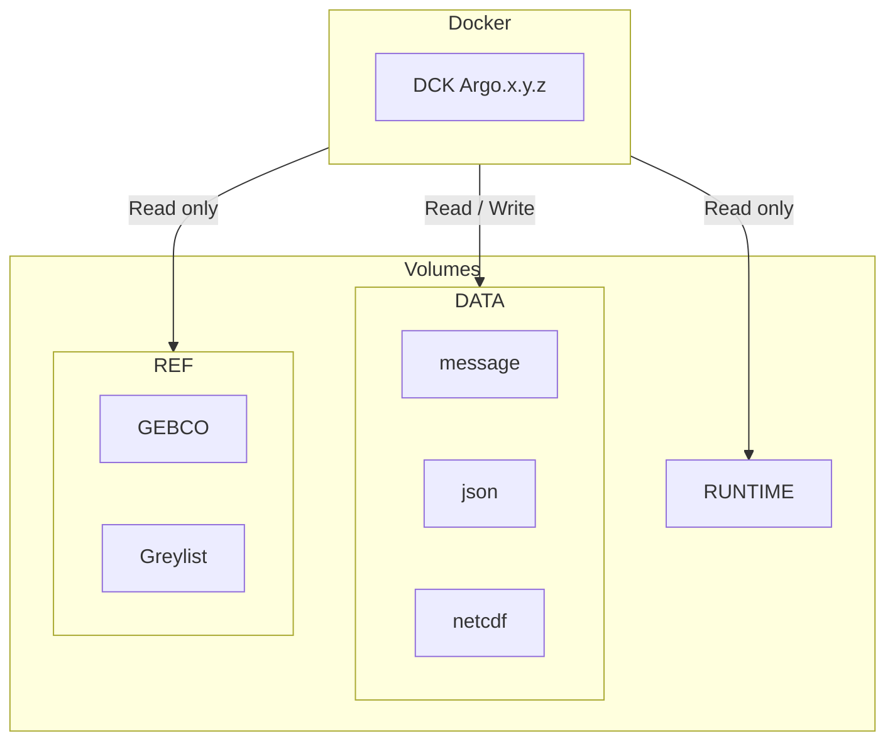

# Coriolis-data-processing-chain-for-Argo-floats-container

Coriolis data processing chain for Argo floats Containerized

## Architecture diagram



**Flux** :

<https://data-argo.ifremer.fr/ar_greylist.txt>

**Volumes** :

- `/mnt/runtime` : Decoder runtime environment
- `/mnt/data/output` : Output files directory
- `/mnt/data/rsync` : Input files directory
- `/mnt/data/config` :  external configurations directory
- `/mnt/ref/gebco.nc` : GEBCO file

## Run image in your environment

Several use cases exist to run the decoder :

1. **The runtime environment is available on your server** : Then you will just need to reference it through an environment variable, the first execution will be quick.
2. **You don't have access to the runtime environment** : Then the runtime environment will be loaded into a Docker image and uploaded on first execution which could take some time (as an example the Matlab environment size is around 12GB).

In this section we propose two ways to run the decoder, it's up to you to choose the one you prefer :

1. using only Docker (is documented only if you have the decoder runtime environment on your server)
2. using Docker compose plugin (is documented in both cases)

### Using Docker

- Prepare your data.
- Define next variables to configure the decoder on your environment.

```bash
DECODER_IMAGE=ghcr.io/euroargodev/coriolis-data-processing-chain-for-argo-floats-container # decoder image path
DECODER_IMAGE_TAG=<decoder image tag> # example : 066a

DECODER_RUNTIME_VOLUME=<path to runtime directory>
DECODER_DATA_INPUT_VOLUME=<path to input directory>
DECODER_DATA_CONF_VOLUME=<path to conf directory>
DECODER_DATA_OUTPUT_VOLUME=<path to output directory>
DECODER_REF_GEBCO_FILE=<path to gebco file> # optionnal
DECODER_REF_GREYLIST_FILE=<path to gebco file> # optionnal

USER_ID=<uid volumes owner> # must match with volumes owner
GROUP_ID=<gid volumes owner> # must match with volumes owner

FLOAT_WMO=<float wmo to decode> # example : 6902892
```

- Run the following script as an example to decode a single float.

```bash
rm -rf $DECODER_DATA_OUTPUT_VOLUME/iridium/*$FLOAT_WMO 
rm -rf $DECODER_DATA_OUTPUT_VOLUME/nc/$FLOAT_WMO

docker run -it --rm \
--name "argo-decoder-container" \
--user $USER_ID:$GROUP_ID \
--group-add gbatch \
-v $DECODER_RUNTIME_VOLUME:/mnt/runtime:ro \
-v $DECODER_DATA_INPUT_VOLUME:/mnt/data/rsync:rw \
-v $DECODER_DATA_CONF_VOLUME:/mnt/data/config:ro \
-v $DECODER_DATA_OUTPUT_VOLUME:/mnt/data/output:rw \
$DECODER_IMAGE:$DECODER_IMAGE_TAG /mnt/runtime 'rsynclog' 'all' 'configfile' '/app/config/_argo_decoder_conf_ir_sbd.json' 'configfile' '/app/config/_argo_decoder_conf_ir_sbd_rem.json' 'xmlreport' 'co041404_'$(date +"%Y%m%dT%H%M%SZ")'_'$FLOAT_WMO'.xml' 'floatwmo' ''$FLOAT_WMO'' 'PROCESS_REMAINING_BUFFERS' '1'
```

### Using Docker compose plugin

- Prepare your data.
- Copy `.env.docs` as `.env` file, and costumize variables to configure the decoder for your environment.
      
      ```bash
      cp .env.docs .env
      vim .env
      ```

- Run the following command as an example to decode a single float.
    1. if you **have** the **runtime environment on your server**.

            ```bash
            docker compose up
            ```
    2. if you **do not have** the **runtime environment on your server**.

            ```bash
            docker compose -f compose.yaml -f compose.matlab-runtime.yaml up
            ```

## Development

### Build image locally

- Use the following command to build the Docker image.

```bash
docker buildx build -t decoder:development .
```

- Run see run section to run the image.

## Demo

This demonstration will run the Coriolis-data-processing-chain-for-Argo-floats based on a Dockerised Matlab Runtime on two Argo floats :

  - Arvor 6903014 : <https://fleetmonitoring.euro-argo.eu/float/6903014>
  - Arvor Deep 6903014 : <https://fleetmonitoring.euro-argo.eu/float/6902892>

### Prepare your environment

1. Lunix operating system **Required**
2. Folowing procedure to [Install Docker Engine](https://docs.docker.com/engine/install/#supported-platforms) according to your operating system, or use next example using generic script (not recommended for production environments)

      ```bash
      # Install docker with generic script 
      curl -fsSL https://get.docker.com/ | sudo sh

      # add your user to docker group
      sudo usermod -aG docker $USER

      # Check that the Docker Engine installation is successful by running the hello-world image
      sudo docker run hello-world
      ```

3. Install Git (*Optionnal*)

      ```bash
      sudo apt update
      sudo apt install git
      ```

### Run demo with docker compose

1. Upload the project with demonstration dataset

   - Option 1 : Using Git

   ```bash
   cd path-to-working-directory
   git clone -b feature/workshop https://github.com/euroargodev/Coriolis-data-processing-chain-for-Argo-floats.git
   cd Coriolis-data-processing-chain-for-Argo-floats
   ```

   - Option 2 : Manual download

   ```bash
   cd path-to-working-directory
   wget https://github.com/euroargodev/Coriolis-data-processing-chain-for-Argo-floats/archive/refs/heads/feature/workshop.zip
   unzip workshop.zip -d ./Coriolis-data-processing-chain-for-Argo-floats
   cd Coriolis-data-processing-chain-for-Argo-floats
   ```

2. Edit environment variables `.env.demo` file with your favorite text editor to setup your configuration, or use the next commands :

      ```bash
      # or at least these commands tu setup your user
      sed -i "s/REPLACE_BY_USER_ID/$UID/g" .env
      sed -i "s/REPLACE_BY_GROUP_ID/$(id -g $UID)/g" .env
      ```

3. Run decoder demo with matlab runtime thanks to docker compose

      ```bash
      docker compose --env-file .env.demo -f compose.base.yaml -f compose.matlab-runtime.yaml up
      ```

4. Check next directory to see decoder outputs : `./decArgo_demo/output`
