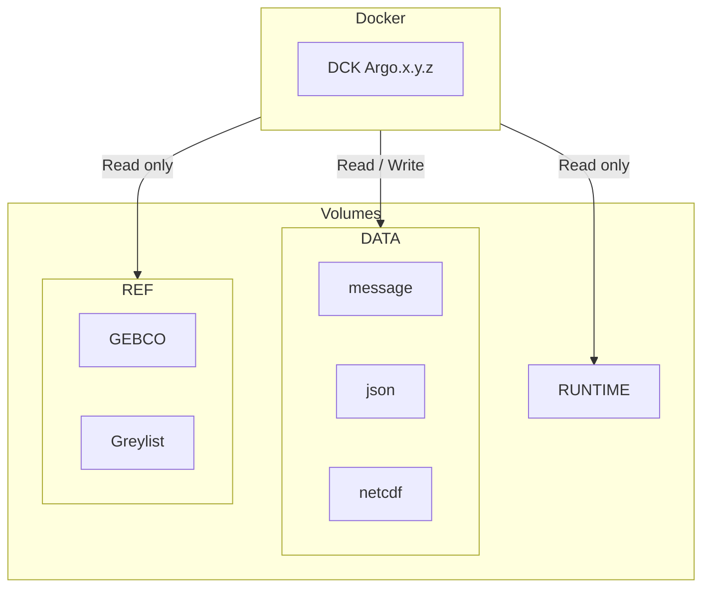

# Coriolis-data-processing-chain-for-Argo-floats-container

Coriolis data processing chain for Argo floats Containerized

## Architecture diagram



**Volumes** :

- `/mnt/runtime` : Decoder runtime environment
- `/mnt/data/output` : Output files directory
- `/mnt/data/rsync` : Input files directory
- `/mnt/data/config` : external configurations directory
- `/mnt/ref/gebco.nc` : GEBCO file
- `/tmp/ar_greylist.txt` :Greylist

## Run image in your environment

Several use cases exist to run the decoder :

1. **The runtime environment is available on your server** : Then you will just need to reference it through an environment variable, the first execution will be quick.
2. **You don't have access to the runtime environment** : Then the runtime environment will be loaded into a Docker image and uploaded on first execution which could take some time (as an example the Matlab environment size is around 15GB).

In this section we propose two ways to run the decoder, it's up to you to choose the one you prefer :

1. using only Docker (is documented only if you have the decoder runtime environment on your server)
2. using Docker compose plugin (is documented in both cases)

---

### Using a local runtime environment with Docker

## Prepare your data

| **Linux Operating System** | **Windows Operating System** |
|----------------------------|-------------------------------|
| Customize the following variables in `docker-decoder-linux.sh`: | Customize the following variables in `docker-decoder-windows.bat`: |
| `DECODER_IMAGE_TAG=<decoder image tag> # example : 066a`<br>`DECODER_RUNTIME_VOLUME=<path to runtime directory>`<br>`DECODER_DATA_INPUT_VOLUME=<path to input directory>`<br>`DECODER_DATA_CONF_VOLUME=<path to conf directory>`<br>`DECODER_DATA_OUTPUT_VOLUME=<path to output directory>`<br>`DECODER_REF_GEBCO_FILE=<path to gebco file> # optional`<br>`DECODER_REF_GREYLIST_FILE=<path to greylist file> # optional`<br>`USER_ID=<uid volumes owner> # must match with volumes owner`<br>`GROUP_ID=<gid volumes owner> # must match with volumes owner` | `set DECODER_IMAGE_TAG=<decoder image tag>`<br>`set DECODER_RUNTIME_VOLUME=<path to runtime directory>`<br>`set DECODER_DATA_INPUT_VOLUME=<path to input directory>`<br>`set DECODER_DATA_CONF_VOLUME=<path to conf directory>`<br>`set DECODER_DATA_OUTPUT_VOLUME=<path to output directory>`<br>`set DECODER_REF_GEBCO_FILE=<path to gebco file> # optional`<br>`set DECODER_REF_GREYLIST_FILE=<path to greylist file> # optional` |
| Run the script to decode a single float:`./docker-decoder-linux.sh 6902892` | Run the script to decode a single float:`./docker-decoder-windows.bat 6902892` |

---

### Using a Dockerized runtime environment with Docker Compose

#### Matlab runtime environment

- Prepare your data.
- Copy `.env.docs` as `.env` file, and costumize variables to configure the decoder for your environment.

| **Linux Operating System** | **Windows Operating System** |
|----------------------------|-------------------------------|
| Run the following script to decode a single float:<br><br>`./docker-decoder-matlab-linux.sh 6902892` | Run the following script to decode a single float:`./docker-decoder-matlab-windows.bat 6902892` |

---

## Development

### Build image locally

- Use the following command to build the Docker image.

```bash
docker buildx build -t decoder:development .
```

- Run see run section to run the image.

## Demo on Linux operating system

This demonstration will run the Coriolis-data-processing-chain-for-Argo-floats based on a Dockerised Matlab Runtime on two Argo floats :

- Arvor 6903014 : <https://fleetmonitoring.euro-argo.eu/float/6903014>
- Arvor Deep 6903014 : <https://fleetmonitoring.euro-argo.eu/float/6902892>

### Prepare your environment

1. Linux operating system **Required**
2. Folowing procedure to [Install Docker Engine](https://docs.docker.com/engine/install/#supported-platforms) according to your operating system, or use next example using generic script (not recommended for production environments)

   ```bash
   # Install docker with generic script
   curl -fsSL https://get.docker.com/ | sudo sh

   # add your user to docker group
   sudo usermod -aG docker $USER

   # Check that the Docker Engine installation is successful by running the hello-world image
   sudo docker run hello-world
   ```

3. Install Git (_Optional_)

   ```bash
   sudo apt update
   sudo apt install git
   ```

### Run demo

- Upload the project with demonstration dataset

  - Option 1 : Using Git

  ```bash
  cd path-to-working-directory
  git clone -b feature/workshop https://github.com/euroargodev/Coriolis-data-processing-chain-for-Argo-floats.git
  cd Coriolis-data-processing-chain-for-Argo-floats
  ```

  - Option 2 : Manual download

  ```bash
  cd path-to-working-directory
  wget https://github.com/euroargodev/Coriolis-data-processing-chain-for-Argo-floats/archive/refs/heads/feature/workshop.zip
  unzip workshop.zip -d ./Coriolis-data-processing-chain-for-Argo-floats
  cd Coriolis-data-processing-chain-for-Argo-floats
  ```

#### with local runtime environment

1. Run the following script as an example to decode a single float.

   ```bash
   ./docker-decoder-linux.sh 6902892 /absolute-path-to/matlab/runtime/R202XX
   ```

2. Check next directory to see decoder outputs : `./decArgo_demo/output`

#### with Dockerized runtime environment

1. Copy `.env.demo` as `.env` file to configure the decoder for the demonstration.

2. Run decoder demo with matlab runtime thanks to docker compose

   ```bash
   ./docker-decoder-matlab-linux.sh 6902892
   ```

3. Check next directory to see decoder outputs : `./decArgo_demo/output`

After you have tried the demo floats, if you wish to use the decoder for your own floats you can follow the steps taken to run a sample BODC float.
[Decoding a BODC-SAMPLE-FLOAT](decArgo_doc/Setup_and_running_decoder_with_sample_BODC_float/README.md)
