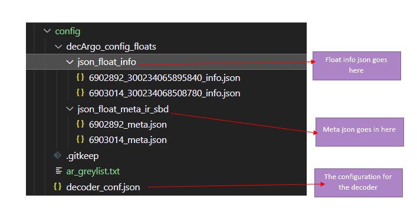
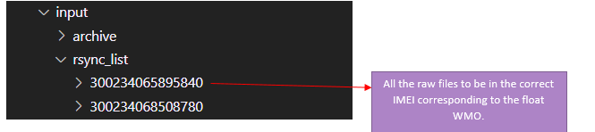
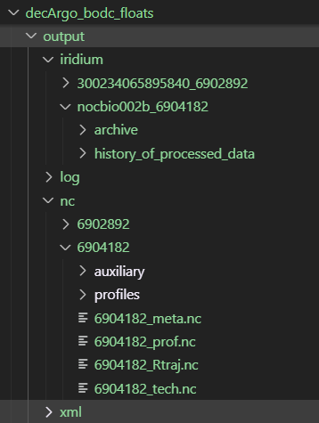

## Running the Argo decoder

Instructions for running the decoder and testing floats are given in the [main README.md](Coriolis-data-processing-chain-for-Argo-floats-container\README.md)

## Running BODC floats

When running the decoder for **BODC floats**, it is important to follow the expected directory structure.

### Directory structure

There are 3 main directories that need to be set up. They are the config, input and output.

### Configuration


The config directory must include the decoder_configuration file.

- The decoder config file should preferably named **`decoder_conf.json`**
- If you decide to change the filenames or move the files to different folder then ensure the changes are reflected in the decoder config file `decoder_conf.json` and the `.env`.
  - for example if metadata files is moved to another folder, update the config line accordinglyin the decoder_conf.json:

  ```json
  "DIR_INPUT_JSON_FLOAT_META_DATA_FILE" : "/mnt/data/config/decArgo_config_floats/json_float_meta_ir_sbd/"
  ```

- If the filename of the decoder configuration is changed, update the reference in the `DOCKER_COMMAND` within the invocation shell script (`docker-decoder-matlab-linux.sh` or `docker-decoder-linux.sh`).

Example:

```bash
export DECODER_COMMAND=$(echo /mnt/runtime 'rsynclog' 'all' 'configfile' '/mnt/data/config/decoder_conf.json' 'xmlreport' 'co041404_'$(date "%Y%m%dT%H%M%SZ")'_'$FLOAT_WMO'.xml' 'floatwmo' ''$FLOAT_WMO'' 'PROCESS_REMAINING_BUFFERS' '1')
```

### Float or DAC specific

Some floats may require DAC-specific or float-specific TESTS.  
for example:

- To **toggle RTQC**:

```json
"APPLY_RTQC" : "1"
```

- To **override reference files** (e.g. the greylist file):
  1. In `.env`, create a variable for the override path:
     ```env
     DECODER_REF_GREYLIST_FILE=./decArgo_demo/config/ar_greylist.txt
     ```
  2. In `docker-compose.yml`, add a volume mount:
     ```yaml
     - ${DECODER_REF_GREYLIST_FILE}:/tmp/ar_greylist.txt:ro
     ```
  3. In `decoder_conf.json`, point to the mounted file:
     ```json
     "TEST015_GREY_LIST_FILE" : "/tmp/ar_greylist.txt"
     ```

### Config changes for BODC floats

For BODC testing, the following adjustments were applied:

- `TEST004_ETOPO2_FILE` → removed (land/water check not needed)
- `CHLA_COR_FACT_FILE` → removed (CHLA file not yet ready for publication)
- `WOA_STANDARD` → use default file included in image (`woa13_all_n00_01.nc`)

### Input files

Email and `.txt` input files for each float must be placed in the correct folder, respecting the directory structure.

In case the directory names are changed, the changes need to be reflected in the decoder_conf.json.

### Output files

All the Output files, including the log. nc and processed history are stored under the output directory. .

In case the directory names are changed, the changes need to be reflected in the decoder_conf.json.

### Running with a specific decoder tag

If you need to run with a decoder tag other than the one specified in the env file, specify it when invoking the shell script:

```bash
./docker-decoder-matlab-linux.sh 6902892 067a
```
